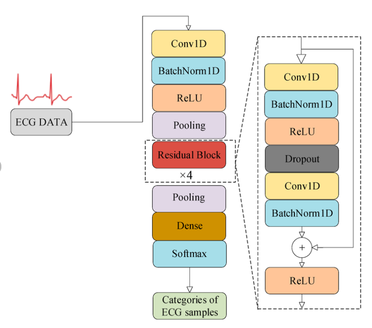
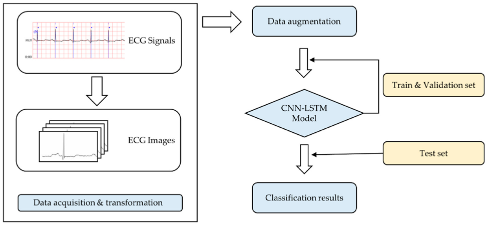
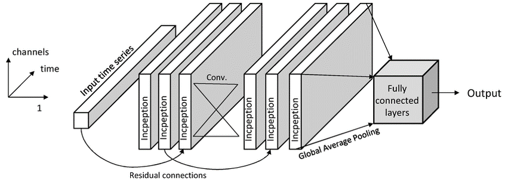
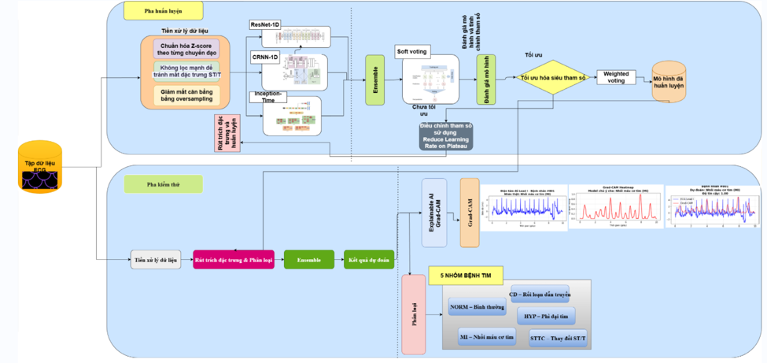
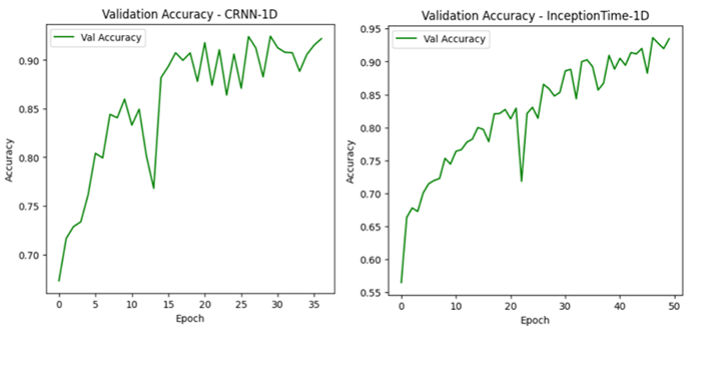
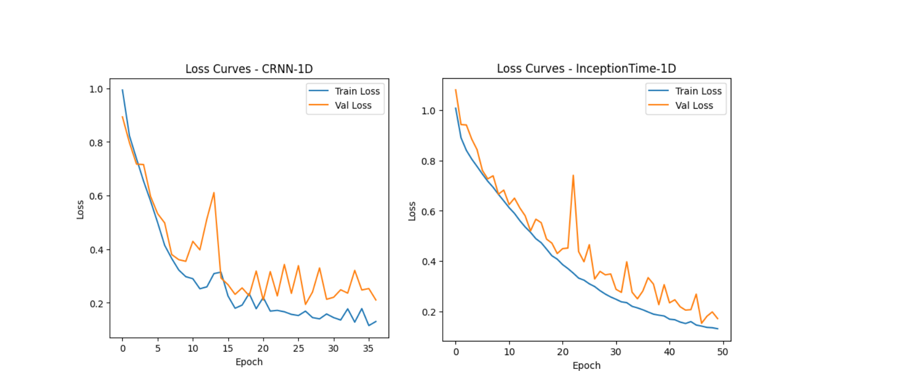
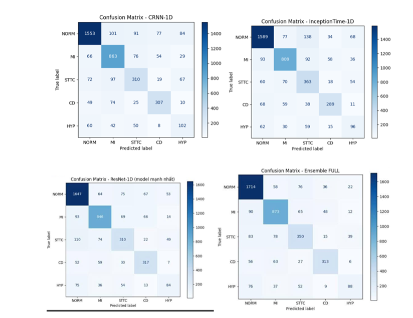
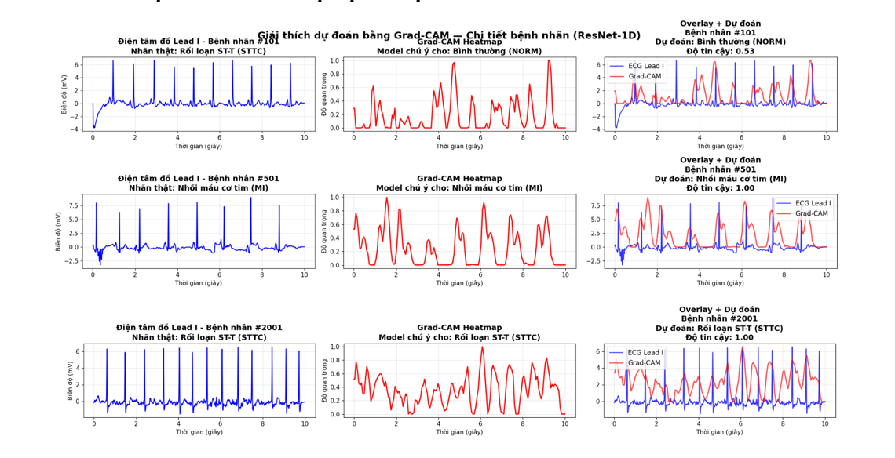

# Heart Disease Classification using Ensemble Learning

## 📌 Giới thiệu dự án
Đây là **dự án chuyên đề AI** được thực hiện trong quá trình học tập, tập trung vào việc xây dựng **hệ thống phân loại bệnh tim** dựa trên **kỹ thuật Ensemble Learning**, kết hợp **nhiều mô hình học máy và học sâu** nhằm nâng cao độ chính xác dự đoán.

---

## 🎯 Mục tiêu
- Xây dựng **các mô hình phân loại bệnh tim độc lập**
- Kết hợp các mô hình bằng **Ensemble Learning**
- So sánh hiệu quả giữa **mô hình đơn lẻ** và **mô hình kết hợp**
- Đánh giá mô hình thông qua **Accuracy và Loss**

---

## 🧠 Công nghệ & Công cụ sử dụng
- **Ngôn ngữ:** Python  
- **Thư viện:** NumPy, Pandas, Scikit-learn, TensorFlow / Keras  
- **Kỹ thuật:** Machine Learning, Deep Learning, Ensemble Learning  
- **Môi trường:** Jupyter Notebook  

---

## ⚙️ Quy trình thực hiện
1. Tiền xử lý và chuẩn hóa dữ liệu bệnh tim  
2. Huấn luyện **3 mô hình phân loại độc lập**  
3. Kết hợp các mô hình bằng **Ensemble Learning**  
4. Đánh giá và so sánh kết quả từng mô hình  
5. Phân tích kết quả và rút ra kết luận  

---

## 🧩 Các mô hình được sử dụng

### 🔹 Mô hình 1: Resnet1D

### 🔹 Mô hình 2: Convolutional Neural Network (CNN)

### 🔹 Mô hình 3: InceptionTime

### 🔹 Mô hình Ensemble (kết hợp)

---

## 📊 Kết quả huấn luyện

### 🔹 Độ chính xác (Accuracy)

### 🔹 Hàm mất mát (Loss)

### 🔹 Ma trận nhầm lẫn

### 🔹 Kết quả chuẩn đoán kết hợp

---

## 📈 Nhận xét kết quả
- Các mô hình đơn lẻ cho kết quả **ổn định**
- Mô hình **Ensemble cho độ chính xác cao hơn** so với từng mô hình riêng lẻ
- Việc kết hợp mô hình giúp **giảm sai lệch và tăng khả năng tổng quát hóa**

---

## ✅ Kết luận
- Ensemble Learning cho thấy **hiệu quả rõ rệt trong phân loại bệnh tim**
- Dự án giúp củng cố kiến thức về:
  - Machine Learning
  - Deep Learning
  - Ensemble Modeling
  - Xử lý dữ liệu y tế
- Phù hợp cho mục đích **nghiên cứu và học tập**

---

## 👤 Thông tin sinh viên 
- **Vai trò:** Người phát triển chính (xây dựng mô hình, huấn luyện, đánh giá)  
- **Loại dự án:** Chuyên đề AI / Đồ án học tập  

---

📌 *Dự án phục vụ mục đích học tập, không sử dụng cho chẩn đoán y khoa thực tế.*
